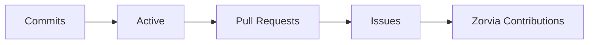
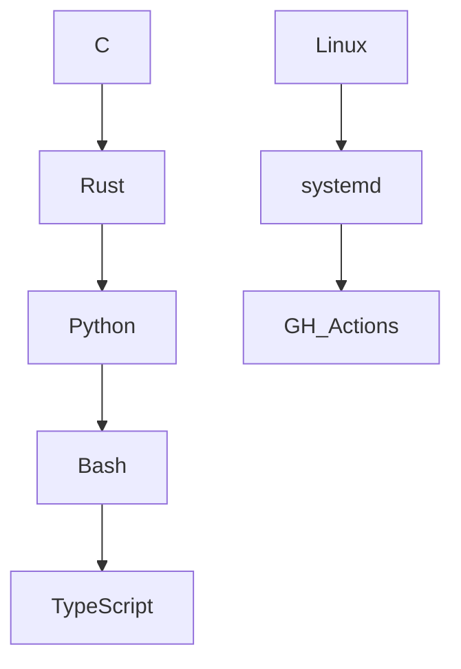

# ⊶ hey, i’m **luvaary** ⊷

```bash
┌─────────────────────────────────────────────┐
│ SYSTEM STATUS : ONLINE                       │
│ USER          : luvaary                      │
│ ROLE          : Founder @ Zorvia             │
│ ENV           : linux / os dev               │
│ THEME         : dark-academia                │
│ MOTTO         : stay sharp, stay shadowed    │
└─────────────────────────────────────────────┘
````

───────────────────────────────

## ⊹ terminal focus ⊹

```bash
> hosting & developing Zorvia (FOSS organization)
> low-level system tooling
> build systems, installers, infrastructure
> minimal, melancholic, dark-academia design
> all code is life, all life is code
```

───────────────────────────────

## ⊹ stack overview ⊹

```bash
╔════════════════════════════════╗
║  C    Rust    Bash    Python    ║
║  Linux RPM/DNF systemd GH Actions ║
╚════════════════════════════════╝
```

[](https://en.wikipedia.org/wiki/C_%28programming_language%29)
[](https://www.rust-lang.org/)
[](https://www.gnu.org/software/bash/)
[](https://www.python.org/)
[](https://www.typescriptlang.org/)

───────────────────────────────

## ⊹ philosophy ⊹

```bash
> small. sharp. intentional.
> i exist where code meets silence.
> i leave traces in the dark.
> every commit is a heartbeat in the void
```

───────────────────────────────

## ⊹ live metrics ⊹

```bash
┌───────────────────────────────┐
│ GITHUB DASHBOARD               │
└───────────────────────────────┘
```


───────────────────────────────

## ⊹ animated terminal graphs ⊹





───────────────────────────────

## ⊹ terminal badges ⊹

```text
████████████████████████████████████████
████  LINUX       █████████████████████
████  RUST        █████████████████████
████  PYTHON      █████████████████████
████  OPEN SOURCE █████████████████████
████  ZORVIA      █████████████████████
████████████████████████████████████████
```

───────────────────────────────

## ⊹ ultra-glow footer ⊹

```bash
> SYSTEM CHECK : OK
> STATUS       : sharp, shadowed, curious
> USER         : luvaary
> END OF LINE  : — alive in code, alive in the dark.
> TYPE `help` FOR MORE.
```

───────────────────────────────

<style>
/* Animated gradient text for headings */
h1, h2, h3, h4 {
  background: linear-gradient(90deg, #00ffcc, #111111, #00ffcc);
  -webkit-background-clip: text;
  -webkit-text-fill-color: transparent;
  animation: gradientMove 3s infinite linear;
}

@keyframes gradientMove {
  0% { background-position: 0% }
  100% { background-position: 200% }
}

/* Glow effect for badges */
img[alt*="badge"] {
  filter: drop-shadow(0 0 6px #00ffcc);
}
</style>

```
```
