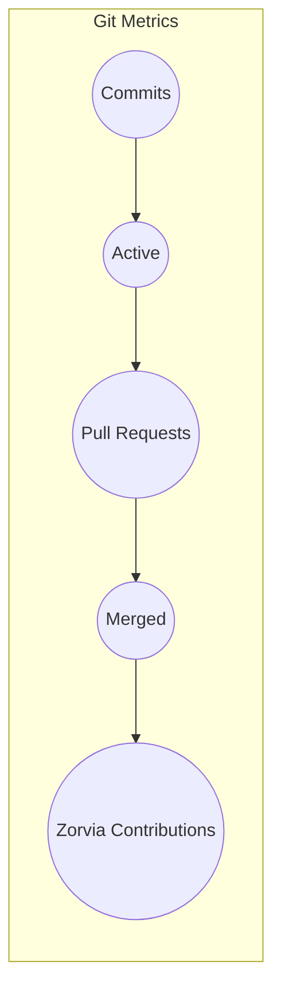
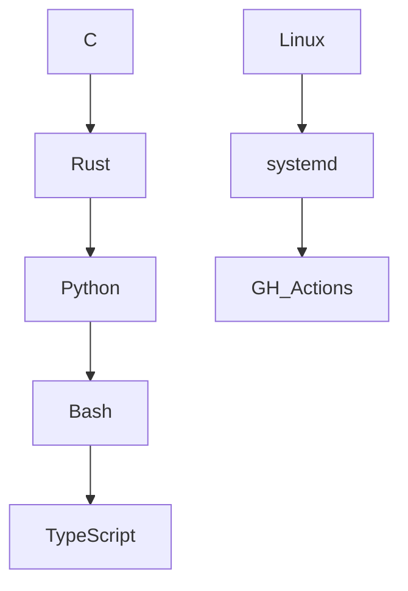

# ⊶ hey, i’m **luvaary** ⊷

```bash
┌─────────────────────────────────────────────┐
│ SYSTEM STATUS : ONLINE                       │
│ USER          : luvaary                      │
│ ROLE          : Founder @ Zorvia             │
│ ENV           : linux / os dev               │
│ THEME         : dark-academia                │
│ MOTTO         : stay sharp, stay shadowed    │
└─────────────────────────────────────────────┘
````

───────────────────────────────

## ⊹ terminal focus ⊹

```bash
> hosting & leading Zorvia (FOSS organization)
> building low-level system tooling & infrastructure
> minimal, melancholic, dark-academia design
> all code is life, all life is code
```

───────────────────────────────

## ⊹ live metrics ⊹

```bash
┌───────────────────────────────┐
│  LIVE GITHUB METRICS           │
└───────────────────────────────┘
```


───────────────────────────────

## ⊹ animated terminal graphs ⊹





───────────────────────────────

## ⊹ stack overview ⊹

```bash
╔════════════════════════════════╗
║  C    Rust    Bash    Python    ║
║  Linux   systemd   GH Actions   ║
╚════════════════════════════════╝
```

[](https://en.wikipedia.org/wiki/C_%28programming_language%29)
[](https://www.rust-lang.org/)
[](https://www.gnu.org/software/bash/)
[](https://www.python.org/)
[](https://www.typescriptlang.org/)

───────────────────────────────

## ⊹ philosophy ⊹

```bash
> small. sharp. intentional.
> i exist where code meets silence.
> every commit is a breath in the void.
```

───────────────────────────────

## ⊹ terminal badges ⊹

```text
████████████████████████████████████████
████  LINUX       █████████████████████
████  RUST        █████████████████████
████  PYTHON      █████████████████████
████  OPEN SOURCE █████████████████████
████  ZORVIA      █████████████████████
████████████████████████████████████████
```

───────────────────────────────

```bash
> SYSTEM CHECK : OK
> STATUS       : existing
> USER         : luvaary
```
